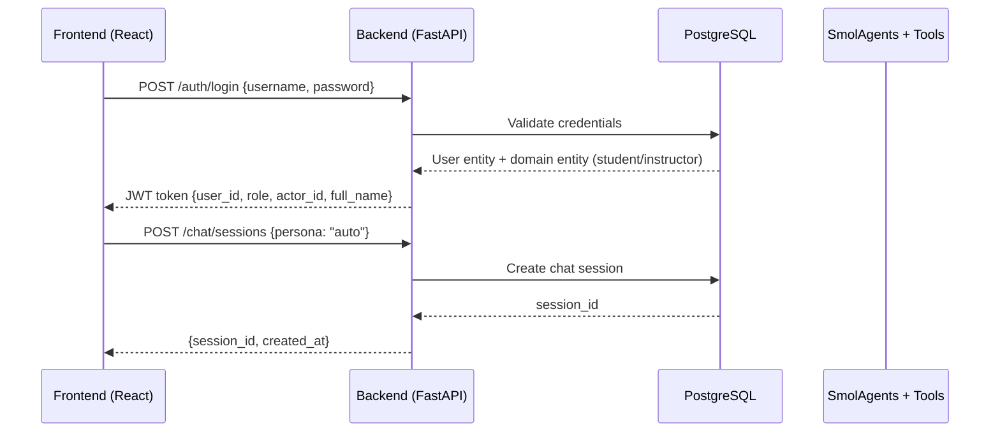
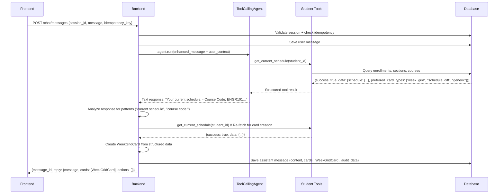
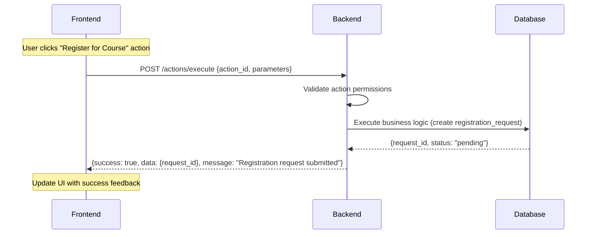

# BRS Prototype

This repository contains a working prototype of the Business Registration
System (BRS) described in the provided Business Requirements
Specification (BRS) document. The goal of this prototype is to
demonstrate a modular architecture across a PostgreSQL database,
a Python/FastAPI backend, a unified React front‑end for all roles,
and optional automation workflows via n8n. The OpenAI
API is integrated to show how large language models can augment the
workflow by summarising student justifications and providing intelligent
assistance.

## Project Structure

```
brs_prototype/
├── backend/           # FastAPI application with modular structure
│   ├── brs_backend/   # Main application module
│   │   ├── main.py    # FastAPI app entry point
│   │   ├── core/      # Configuration and logging
│   │   ├── database/  # Database connection
│   │   ├── models/    # SQLAlchemy models
│   │   ├── agents/    # AI agents and tools
│   │   ├── api/       # REST API endpoints
│   │   ├── auth/      # JWT authentication
│   │   ├── chat/      # Chat system integration
│   │   ├── services/  # Business logic services
│   │   └── seed_personas.py # Database seeding
│   ├── entrypoint.sh  # Docker container startup
│   ├── tests/         # Comprehensive test suite (20 tests)
│   └── README.md      # Backend documentation
├── database/          # SQL schema definitions
├── demo/              # Demo assets and video materials
├── frontend/          # Unified React UI for all roles
├── n8n/               # Example n8n workflow definitions
├── tests/             # System-wide integration tests
└── README.md          # You are here
```

## Quick Start with Docker

The fastest way to get started is using Docker Compose, which will automatically set up the database, backend, and frontend:

```bash
# 1. Copy environment template
cp .env.example .env

# 2. Edit .env and configure your OpenAI API key
# OPENAI_API_KEY=your-openai-api-key-here

# 3. Launch the entire application stack
docker-compose up --build -d

# 4. Access the application
# Frontend: http://localhost:3000
# Backend API: http://localhost:8000
```

## System Architecture

### Data Schema & Database Tables

The BRS system uses a PostgreSQL database with a normalized schema designed for academic course management. The database is organized into several key domains:

#### Core Authentication & User Management
```sql
-- Users table (composition pattern for authentication)
users (
    user_id UUID PRIMARY KEY,
    username VARCHAR(50) UNIQUE,
    email VARCHAR(100) UNIQUE,
    full_name VARCHAR(100),
    user_type VARCHAR(30), -- student, instructor, department_head, system_admin
    password_hash VARCHAR(255),
    is_active INTEGER DEFAULT 1,
    student_id UUID,      -- Reference to domain entity
    instructor_id UUID,   -- Reference to domain entity
    department_head_id UUID,
    admin_id UUID,
    created_at TIMESTAMP,
    updated_at TIMESTAMP
)
```

#### Academic Domain Models
```sql
-- Campus and Program hierarchy
campus (campus_id UUID, name TEXT, location TEXT)
program (program_id UUID, name TEXT, max_credits INTEGER, campus_id UUID)
term (term_id UUID, name TEXT, starts_on DATE, ends_on DATE,
      registration_starts_on DATE, registration_ends_on DATE)

-- Student entity with academic standing
student (
    student_id UUID PRIMARY KEY,
    external_sis_id TEXT UNIQUE,
    program_id UUID,
    campus_id UUID,
    standing TEXT CHECK (standing IN ('regular', 'probation', 'suspended')),
    student_status TEXT CHECK (student_status IN ('new', 'following_plan', 'expected_graduate', 'struggling')),
    gpa DECIMAL(3,2),
    credits_completed INTEGER DEFAULT 0,
    financial_status TEXT CHECK (financial_status IN ('clear', 'owed', 'exempt')),
    study_type TEXT CHECK (study_type IN ('paid', 'free', 'scholarship')),
    expected_grad_term UUID
)

-- Course catalog and prerequisites
course (
    course_id UUID PRIMARY KEY,
    code TEXT NOT NULL,        -- e.g., "ENGR101"
    title TEXT NOT NULL,       -- e.g., "Introduction to Engineering"
    credits INTEGER NOT NULL,
    department_id UUID,
    level INTEGER,             -- 100, 200, 300, 400 level courses
    course_type TEXT CHECK (course_type IN ('major', 'university', 'elective')),
    semester_pattern TEXT CHECK (semester_pattern IN ('odd', 'even', 'both')),
    delivery_mode TEXT CHECK (delivery_mode IN ('in_person', 'online', 'hybrid')),
    campus_id UUID
)

course_prereq (
    course_id UUID,           -- Course that has prerequisite
    req_course_id UUID,       -- Required prerequisite course
    PRIMARY KEY (course_id, req_course_id)
)
```

#### Section Scheduling & Enrollment
```sql
-- Course sections with scheduling
section (
    section_id UUID PRIMARY KEY,
    course_id UUID,
    term_id UUID,
    campus_id UUID,
    instructor_id UUID,
    section_code VARCHAR(10), -- "A1", "B2", etc.
    max_capacity INTEGER,
    current_enrollment INTEGER DEFAULT 0,
    waitlist_capacity INTEGER DEFAULT 0,
    current_waitlist INTEGER DEFAULT 0,
    status VARCHAR(20) CHECK (status IN ('open', 'closed', 'cancelled')),
    room_id UUID,
    schedule TSRANGE,         -- PostgreSQL time range for scheduling
    delivery_mode TEXT
)

-- Student enrollments (active registrations)
enrollment (
    enrollment_id UUID PRIMARY KEY,
    student_id UUID,
    section_id UUID,
    enrollment_status VARCHAR(20) CHECK (status IN ('enrolled', 'waitlisted', 'dropped')),
    enrollment_date TIMESTAMP,
    grade VARCHAR(5),         -- Final grades: A+, A, B+, etc.
    UNIQUE(student_id, section_id)
)
```

#### Registration Request Workflow
```sql
-- Registration requests with approval workflow
registration_request (
    request_id UUID PRIMARY KEY,
    student_id UUID,
    section_id UUID,
    request_type VARCHAR(30) CHECK (type IN ('add', 'drop', 'swap')),
    status VARCHAR(20) CHECK (status IN ('pending', 'approved', 'denied', 'cancelled')),
    priority INTEGER DEFAULT 0,
    justification TEXT,
    ai_summary TEXT,          -- AI-generated summary of student's justification
    submitted_at TIMESTAMP,
    reviewed_at TIMESTAMP,
    reviewer_id UUID,         -- instructor/department_head who reviewed
    reviewer_notes TEXT,
    decision_reason TEXT
)
```

#### Chat System Integration
```sql
-- Chat sessions for conversational interface
chat_session (
    session_id UUID PRIMARY KEY,
    user_id UUID,
    persona VARCHAR(50) DEFAULT 'auto',
    created_at TIMESTAMP,
    last_activity TIMESTAMP
)

-- Chat messages with rich cards and actions
chat_message (
    message_id UUID PRIMARY KEY,
    session_id UUID,
    role VARCHAR(20) CHECK (role IN ('user', 'assistant')),
    content TEXT,
    cards JSONB,              -- Rich UI cards (schedule grids, course info, etc.)
    actions JSONB,            -- Available actions (register, drop, etc.)
    attachments JSONB,
    audit_data JSONB,         -- Correlation IDs, tool calls, timing
    client_idempotency_key VARCHAR(100),
    created_at TIMESTAMP
)
```

### Request Flow: Frontend → Backend → Frontend

The BRS system follows a clean request-response pattern with rich data exchange:

#### 1. Authentication & Session Creation


#### 2. Chat Message Processing


#### 3. Rich Card Rendering Pipeline
```javascript
// Frontend card rendering flow
{
  type: "week_grid",
  payload: {
    student_id: "uuid",
    schedule: [
      {
        course_code: "ENGR101",
        course_title: "Introduction to Engineering",
        section_code: "A1",
        instructor_name: "Dr. Ahmad Mahmoud",
        schedule_text: "Monday 09:00-10:30 (Lecture)",
        room: "ENG-101",
        credits: 3
      }
    ],
    total_credits: 3,
    metadata: {generated_at: "2025-10-01T16:13:00Z"}
  }
}
```

#### 4. Action Execution Flow


#### 5. Tool Architecture & Card Generation
```python
# Backend tool calling pattern
class StudentTools:
    def get_current_schedule(context: dict) -> dict:
        student_id = context["student_id"]

        # Database query for enrolled sections
        enrollments = session.query(Enrollment).filter(
            Enrollment.student_id == student_id,
            Enrollment.enrollment_status == 'enrolled'
        ).all()

        # Transform to structured format
        schedule_data = {
            "student_id": student_id,
            "schedule": [transform_enrollment(e) for e in enrollments],
            "total_credits": sum(e.section.course.credits for e in enrollments)
        }

        return {
            "success": True,
            "preferred_card_types": ["week_grid", "schedule_diff", "generic"],
            "data": schedule_data
        }

# Card creation pipeline
async def _create_cards_from_response_analysis(response_text: str, user_claims: JWTClaims):
    if "current schedule" in response_text.lower():
        # Re-fetch structured data for card creation
        result = get_current_schedule({"student_id": user_claims.actor_id})
        if result["success"]:
            return [await _create_week_grid_card(result["data"], user_claims.actor_id)]
    return []
```

#### 6. Data Flow Summary

**Request Path:**
1. **Frontend** → JWT-authenticated HTTP request → **Backend**
2. **Backend** → Enhanced message with user context → **ToolCallingAgent (SmolAgents)**
3. **ToolCallingAgent** → Function calls → **Student Tools**
4. **Student Tools** → SQL queries → **PostgreSQL Database**
5. **Database** → Structured results → **Tools** → **Agent** → **Backend**
6. **Backend** → Response analysis + card creation → **Frontend**

**Key Features:**
- **Idempotency:** Client-side idempotency keys prevent duplicate processing
- **Rich Cards:** Structured data transformed into interactive UI components
- **Audit Trail:** Complete request tracking with correlation IDs and timing
- **Fallback Handling:** Graceful degradation when tools or AI services fail
- **Type Safety:** Pydantic models ensure data validation throughout the pipeline
# Health Check: http://localhost:8000/health
```

### Prerequisites
- Docker & Docker Compose
- Optional: OpenAI API key for AI chatbot functionality (or Ollama for local AI)

## Architecture Overview

The BRS prototype follows a modern **microservices architecture** with clear separation of concerns, designed for scalability and maintainability. The system is **fully containerized** using Docker and orchestrated with Docker Compose for easy deployment and development.

### System Architecture

```
┌─────────────────┐    ┌─────────────────┐    ┌─────────────────┐
│   Frontend      │    │    Backend      │    │   Database      │
│   (React SPA)   │◄──►│  (FastAPI)      │◄──►│  (PostgreSQL)   │
│   Port 3000     │    │   Port 8000     │    │   Port 5432     │
└─────────────────┘    └─────────────────┘    └─────────────────┘
                                │
                                ▼
                       ┌─────────────────┐
                       │   OpenAI API    │
                       │ (AI Assistant)  │
                       └─────────────────┘
```

### Technology Stack

#### Frontend Layer
- **React 18** - Modern component-based UI library
- **Vite** - Fast build tool and development server
- **JavaScript (ES6+)** - Modern JavaScript with async/await
- **CSS-in-JS** - Inline styling for component encapsulation
- **Fetch API** - HTTP client for backend communication

#### Backend Layer
- **FastAPI** - High-performance Python web framework
- **SQLAlchemy** - Object-Relational Mapping (ORM) for database operations
- **Pydantic** - Data validation and serialization
- **Uvicorn** - ASGI server for serving the FastAPI application
- **OpenAI API** - Large Language Model integration for intelligent assistance
- **Python 3.11** - Modern Python runtime

#### Database Layer
- **PostgreSQL 14** - Relational database with ACID compliance
- **SQLAlchemy Core/ORM** - Database abstraction and query building
- **Connection Pooling** - Efficient database connection management

#### Infrastructure & DevOps
- **Docker** - Containerization platform
- **Docker Compose** - Multi-container application orchestration
- **uv** - High-performance Python package manager
- **Node.js** - JavaScript runtime for frontend tooling

## Current Features

### 🤖 AI-Powered Chatbot Interfaces
- **Natural Language Processing** - Students can request courses using conversational language
- **Function Calling Integration** - Structured intent detection with OpenAI API
- **Markdown Rendering** - Properly formatted AI responses with headers, lists, and emphasis
- **Fallback Detection** - Keyword-based processing when function calling unavailable
- **Multi-Model Support** - Compatible with OpenAI GPT models and local Ollama models

### 📚 Course Management
- **Enrollment Requests** - "I want to add CS201" or "Enroll me in database systems"
- **Course Dropping** - "Remove CS101 from my schedule" or "Drop linear algebra"
- **Status Checking** - "What's the status of my CS201 request?" or "Show my current courses"
- **Course Discovery** - "What courses are available?" or "Show me computer science classes"
- **Recent Updates** - Automatic highlighting of course changes since last login

### 👥 Role-Based Workflows
- **Students** - Conversational course management with AI assistance
- **Advisors** - AI-enhanced request review with intelligent summaries
- **Department Heads** - Final approval authority with context-aware recommendations
- **Administrators** - User management and system oversight

### 🔧 Technical Capabilities
- **Docker Containerization** - One-command deployment with `docker-compose up`
- **Database Management** - PostgreSQL with automatic schema creation and seeding
- **API Integration** - RESTful endpoints with comprehensive error handling
- **Environment Flexibility** - Support for both cloud (OpenAI) and local (Ollama) AI services
- **Development Tools** - Hot reload, structured logging, and health monitoring
- **Comprehensive Testing** - 20 tests covering PostgreSQL operations, session conflicts, and API endpoints
- **Production Logging** - Clean, structured logging with proper log levels and audit trails

### Key Components

#### 1. Chatbot-Powered Student Interface
- **Natural Language Processing** - Students interact using conversational language
- **OpenAI Integration** - Intelligent responses and course recommendations
- **Real-time Chat UI** - Modern messaging interface with message history
- **Fallback Traditional Forms** - Backup interface when AI is unavailable
- **Request Status Tracking** - Visual indicators for request progress

#### 2. RESTful API Architecture
- **Resource-Based Endpoints** - `/users/`, `/requests/`, `/courses/`, `/chat`
- **HTTP Method Semantics** - GET for retrieval, POST for creation
- **JSON Data Exchange** - Standardized data format
- **Error Handling** - Comprehensive HTTP status codes and error messages
- **CORS Support** - Cross-origin requests for frontend integration

#### 3. Database Schema Design
```sql
users              courses            sections           requests
├── id (PK)        ├── id (PK)        ├── id (PK)        ├── id (PK)
├── username       ├── code           ├── course_id (FK) ├── student_id (FK)
├── full_name      ├── name           ├── section_code   ├── course_id (FK)
├── role           ├── description    ├── schedule       ├── request_type
├── major          └── ...            ├── capacity       ├── status
├── gpa                               ├── instructor     ├── justification
└── ...                               └── seats_taken    └── timestamps
```

#### 4. Role-Based Access Control
- **Student Portal** - Course management via chatbot interface
- **Advisor Dashboard** - Request review and approval workflows
- **Department Head Interface** - Final decision authority for referred requests
- **Admin Panel** - User management and system oversight

#### 5. Data Flow Architecture
```
User Input → Frontend Validation → API Request → Backend Processing → Database Query → Response → UI Update
                                        ↓
                                 OpenAI Integration (for chat)
```

### Security Considerations
- **Input Validation** - Pydantic models ensure data integrity
- **SQL Injection Prevention** - SQLAlchemy ORM parameterized queries
- **CORS Configuration** - Controlled cross-origin access
- **Error Message Sanitization** - No sensitive data exposure
- **Environment Variable Management** - Secure configuration handling

### Scalability Features
- **Containerized Architecture** - Easy horizontal scaling
- **Database Connection Pooling** - Efficient resource utilization
- **Stateless Backend** - Enables load balancing
- **Microservices Pattern** - Independent component scaling
- **API-First Design** - Frontend/backend decoupling

## Component Details

### Database Layer (PostgreSQL)

The BRS system uses PostgreSQL as the primary database with comprehensive schema and data management:

- **Automatic Schema Creation** - Tables created on container startup via SQLAlchemy models
- **Data Seeding** - Pre-populated with personas from `backend/brs_backend/seed_personas.py`
- **PostgreSQL Features** - TSRANGE for scheduling, JSON/JSONB for cards and audit data
- **Session Conflict Detection** - Advanced time overlap detection using PostgreSQL TSRANGE
- **Persistent Storage** - Data preserved across container restarts
- **Development Access** - Available at `localhost:5432` with credentials `postgres/postgres`
- **Test Coverage** - 20 comprehensive tests validating all database operations

**Reset Database:**
```bash
docker-compose down -v  # Remove volume
docker-compose up -d    # Restart with fresh data
```

### Backend API (FastAPI)

The FastAPI application provides RESTful endpoints and AI-powered chat functionality:

**Key Features:**
- **OpenAI Integration** - Intelligent chatbot responses and function calling
- **Ollama Support** - Local AI models (qwen2.5vl, llama3.2, gemma3)
- **Automatic Health Checks** - AI service status monitoring
- **Request Processing** - Course enrollment, drop, and status tracking
- **Advisor Workflows** - Request review and approval system

**API Endpoints:**
- `GET /health` - System status and AI configuration
- `POST /chat` - Student chatbot interaction
- `POST /advisor-chat` - Advisor chatbot interface
- `GET /users/` - User management
- `POST /requests/` - Request submission
- `GET /requests/` - Request listing with filters

**Environment Configuration:**
```bash
# OpenAI API (recommended)
OPENAI_API_KEY=your-api-key
OPENAI_API_BASE=https://api.openai.com/v1
OPENAI_MODEL=gpt-3.5-turbo

# OR Ollama (local AI)
OPENAI_API_KEY=ollama
OPENAI_API_BASE=http://host.docker.internal:11434/v1
OPENAI_MODEL=gemma3:27b
```

### Frontend (React SPA)

A modern single-page application serving all user roles with **AI-powered interfaces**:

**Role-Based Interfaces:**
- **Students** - AI chatbot for natural language course management
  - "I want to enroll in CS201"
  - "What courses am I taking?"
  - "Drop my math class"
  - Real-time status updates with markdown rendering
- **Advisors** - Request review with AI assistance for processing
- **Department Heads** - Final decision authority with AI insights
- **Administrators** - User management and system oversight

**Key Features:**
- **Markdown Rendering** - Proper formatting of AI responses
- **Function Calling** - Structured AI interactions with fallback keyword detection
- **Real-time Updates** - Recent request changes highlighted for students
- **Consistent UI** - Unified chatbot interface across all roles
- **Error Handling** - Graceful degradation when AI services are unavailable

### AI Integration Capabilities

**OpenAI Function Calling:**
- Structured intent detection for course requests
- Automatic parameter extraction (course codes, justifications)
- Context-aware responses with course catalog integration

**Fallback Mechanisms:**
- Keyword detection when function calling fails
- Traditional form interface backup
- Error recovery with user guidance

**Supported AI Models:**
- **OpenAI**: GPT-3.5-turbo, GPT-4 (recommended for best function calling)
- **Ollama Local**: gemma3:27b, llama3.2, qwen2.5vl

### n8n Automation

Although a full n8n instance is not included, the `n8n/` folder
contains example workflow JSON files demonstrating how automation could
be used to send email notifications when a request status changes or
trigger reminders for advisors to process pending requests. Import
these files into your n8n instance to explore further.

## Extending the Prototype

This prototype demonstrates modern web application architecture with AI integration. Features to consider adding include:

### Core System Enhancements
* **Authentication and access control** (e.g. JWTs or session tokens).
* **Course and section catalog management** with real-time availability.
* **Student dashboards** showing graduation progress and degree requirements.
* **Integration with university systems** for real schedule updates.
* **Enhanced exception handling** for financial holds, prerequisite violations, and other cases described in the BRS document.

### AI and Chatbot Enhancements
* **Persistent chat history** across user sessions.
* **Course recommendation engine** based on student profile and academic history.
* **Multi-language support** for international students.
* **Voice interface integration** for accessibility.
* **Sentiment analysis** of student requests for proactive support.
* **Advanced NLP** for complex scheduling queries and constraint handling.

### Analytics and Insights
* **Request pattern analysis** to identify popular courses and bottlenecks.
* **Advisor workload balancing** through intelligent request routing.
* **Predictive modeling** for course demand forecasting.
* **Student success tracking** and intervention recommendations.

With its modular architecture, each component can evolve independently
while communicating via well‑defined APIs and a shared database.

## Running with Docker Compose

A `docker-compose.yml` file is provided to launch the entire stack with
a single command. It defines three services:

* **db** – a PostgreSQL database with persisted storage.
* **backend** – a FastAPI service built from `./backend`. It installs
  dependencies using the high‑performance `uv` tool, waits for the
  database to be ready, seeds the personas, and starts the API using
  Uvicorn.
* **frontend** – a static site built from `./frontend` and served via
  a lightweight Node HTTP server.

### Configuration

Before running the application, you need to configure your environment variables:

1. **Copy the environment template:**
   ```bash
   cp .env.example .env
   ```

2. **Edit the `.env` file** and add your OpenAI API key:
   ```bash
   # Required for AI chatbot functionality
   OPENAI_API_KEY=your-actual-openai-api-key-here
   ```

3. **Launch the application:**
   ```bash
   docker-compose up --build
   ```

**Important:** Without a valid `OPENAI_API_KEY`, the AI chatbot will not function and students will see an error message directing them to use the traditional form interface.

### Services

The services will then be available at:

* **Front‑end:** <http://localhost:3000>
* **Backend API:** <http://localhost:8000>
* **Database:** `localhost:5432` with user/password `postgres`
* **Health Check:** <http://localhost:8000/health> (shows OpenAI configuration status)

### Environment Variables

The application supports the following environment variables in your `.env` file:

#### OpenAI Configuration (Cloud AI - Recommended)
```bash
OPENAI_API_KEY=your-openai-api-key-here
OPENAI_API_BASE=https://api.openai.com/v1
OPENAI_MODEL=gpt-3.5-turbo
# Alternative: gpt-4 (better function calling support)
```

#### Ollama Configuration (Local AI - Alternative)
```bash
OPENAI_API_KEY=ollama
OPENAI_API_BASE=http://host.docker.internal:11434/v1
OPENAI_MODEL=gemma3:27b
# Alternatives: llama3.2:latest, qwen2.5vl:latest
```

#### Core Application Settings
```bash
# Database Configuration
DATABASE_URL=postgresql://postgres:postgres@db:5432/brs_prototype_db

# Frontend Configuration
VITE_API_BASE=http://localhost:8000

# Optional: Development Settings
DEBUG=false
LOG_LEVEL=info
```

**Note:** The system will automatically fall back to keyword-based detection if AI function calling is not available.

## Data Seeding Architecture

The BRS prototype uses a comprehensive seeding system to populate the database with realistic test data for demonstration purposes. This system follows a **user-to-role composition model** where users authenticate once and can have multiple domain-specific roles.

### Database Seeding Overview

**Seeding File:** `backend/brs_backend/seed_comprehensive.py`
**Execution:** Automatically runs on container startup via `entrypoint.sh`

The seeding process follows this sequence:

1. **Drop and recreate all tables** - Ensures clean state for demos
2. **Seed domain entities** - Courses, sections, terms, etc.
3. **Create user authentication records** - Links to domain entities
4. **Generate enrollments and requests** - Realistic student scenarios

### Entity Relationship Overview

```
┌─────────────────┐    ┌─────────────────┐    ┌─────────────────┐
│     Users       │    │   Domain        │    │   Enrollments   │
│  (Authentication)│    │   Entities      │    │   & Requests    │
├─────────────────┤    ├─────────────────┤    ├─────────────────┤
│ user_id (PK)    │───►│ Student         │◄──►│ Enrollment      │
│ username        │    │ Instructor      │    │ Request         │
│ user_type       │    │ DepartmentHead  │    │ Section         │
│ student_id (FK) │    │ SystemAdmin     │    └─────────────────┘
│ instructor_id   │    └─────────────────┘
│ dept_head_id    │
│ admin_id        │
└─────────────────┘
```

### User-to-Role Mapping

The authentication system uses a **composition model** where each user record can link to one domain entity:

#### Students
- **Authentication:** `username: "sarah.ahmed"`, `user_type: "student"`
- **Domain Entity:** Links to `Student` table via `student_id`
- **JWT Token:** `actor_id` = `student_id` (not `user_id`)

#### Instructors
- **Authentication:** `username: "dr.rodriguez"`, `user_type: "instructor"`
- **Domain Entity:** Links to `Instructor` table via `instructor_id`
- **JWT Token:** `actor_id` = `instructor_id`

#### Department Heads
- **Authentication:** `username: "prof.wilson"`, `user_type: "department_head"`
- **Domain Entity:** Links to `DepartmentHead` table via `department_head_id`
- **JWT Token:** `actor_id` = `department_head_id`

#### System Administrators
- **Authentication:** `username: "admin.user"`, `user_type: "admin"`
- **Domain Entity:** Links to `SystemAdmin` table via `admin_id`
- **JWT Token:** `actor_id` = `admin_id`

### Seeded Demo Data

#### Test Users (All use password: `password123`)
- **sarah.ahmed** - Student in Engineering program with ENGR101 enrollment
- **mohammed.hassan** - Student with high GPA, multiple course requests
- **fatima.alzahra** - Student testing eligibility and credit limit rules
- **dr.rodriguez** - Instructor teaching engineering courses
- **prof.kim** - Instructor with multiple course sections
- **prof.wilson** - Department Head for approval workflows
- **admin.user** - System administrator access

#### Domain Data
- **Programs:** Engineering, Computer Science, Mathematics
- **Courses:** ENGR101, CS201, MATH301 with prerequisites and credit requirements
- **Sections:** Multiple time slots with realistic schedules using PostgreSQL TSRANGE format
- **Terms:** Academic year 2025-2026 with proper date ranges
- **Campuses & Buildings:** Realistic room assignments (ENGR-101, CS-LAB-A, etc.)

### Time Format Handling

The system handles PostgreSQL's TSRANGE format for class schedules:

**Input Format (from seed_personas.py):**
```python
"time_slot": "[10:00,11:15)"  # Simple time range
```

**Database Format (PostgreSQL TSRANGE):**
```sql
'[2025-01-01 10:00, 2025-01-01 11:15)'  # Full timestamp range
```

**Conversion Logic:**
The seeder automatically converts simple time ranges to full timestamp ranges by adding a reference date (2025-01-01) for proper PostgreSQL TSRANGE storage.

### Resetting Demo Data

To reset the database with fresh seeded data:

```bash
# Method 1: Restart backend container (triggers entrypoint.sh)
docker-compose restart backend

# Method 2: Completely reset with volume cleanup
docker-compose down -v
docker-compose up -d

# Method 3: Manual seeding (for development)
docker-compose exec backend python -m brs_backend.seed_comprehensive
```

## Request Handling & Agent Architecture

The BRS prototype implements a **multi-agent architecture** where different user types interact with specialized AI agents that have access to role-appropriate tools and capabilities.

### Request Flow Overview

```
┌─────────────────┐    ┌─────────────────┐    ┌─────────────────┐
│   Frontend      │    │  Chat Router    │    │  SmolAgents     │
│   (User Input)  │───►│   + Post-       │───►│   Framework     │
│                 │    │   Processing    │    │                 │
└─────────────────┘    └─────────────────┘    └─────────────────┘
                                │                        │
                                ▼                        ▼
                       ┌─────────────────┐    ┌─────────────────┐
                       │   UI Cards      │    │  Agent Tools    │
                       │ (Schedule, etc) │    │ (Role-specific) │
                       └─────────────────┘    └─────────────────┘
```

### Chat Router & Post-Processing

**File:** `backend/brs_backend/agents/chat_agent.py`

The chat system uses a **two-phase approach**:

1. **SmolAgents Processing** - Handle user requests with appropriate tools
2. **Post-Processing** - Transform responses into UI-friendly formats (cards)

**Key Methods:**
- `process_message()` - Main entry point, calls SmolAgents then post-processes
- `_post_process_response()` - Detects response types and adds UI cards
- `_extract_schedule_card()` - Converts schedule text to `CardType.WEEK_GRID`

### Agent Types & Capabilities

#### Student Agent
**Tools Available:**
- `get_current_schedule(student_id)` - View enrolled courses
- `search_sections(course_code)` - Find available course sections
- `create_registration_request()` - Submit add/drop/change requests
- `check_attachable()` - Verify eligibility for course sections
- `get_student_info()` - Access personal academic information

**Example Interactions:**
```
User: "Show me my schedule"
Agent: Uses get_current_schedule() → Post-processor creates schedule card

User: "I want to add CS201"
Agent: Uses search_sections() + create_registration_request()

User: "Can I take advanced algorithms?"
Agent: Uses search_sections() + check_attachable() for prerequisites
```

#### Advisor Agent
**Tools Available:**
- `get_pending_requests()` - View requests requiring advisor approval
- `get_student_profile()` - Access student academic history
- `explain_rule()` - Get business rule explanations for decisions

**Workflow:**
- Review student requests with full academic context
- AI-assisted decision making with rule explanations
- Approve/deny with intelligent justification suggestions

#### Department Head Agent
**Tools Available:**
- `get_pending_requests()` - View escalated requests from advisors
- `get_student_profile()` - Complete student academic records
- `explain_rule()` - Business rule context for final decisions

**Authority:**
- Final approval for requests referred by advisors
- Override capability for special circumstances
- Access to department-wide analytics

#### Registrar Agent
**Tools Available:**
- `get_student_profile()` - Student record access for verification
- Additional tools can be added for enrollment management

### Tool Implementation

**Location:** `backend/brs_backend/agents/`
- `student_tools.py` - Student-specific database operations
- `advisor_tools.py` - Advisor workflow functions
- `department_tools.py` - Department head capabilities

**Example Tool Function:**
```python
def get_current_schedule(student_id: str, term_id: str = None) -> dict:
    """Get student's enrolled courses with meeting details."""
    # Database query logic
    # Returns structured data for UI consumption
```

### Authentication & Role Routing

**JWT Token Structure:**
```python
{
    "sub": "sarah.ahmed",           # Username
    "user_type": "student",         # Role determines agent selection
    "actor_id": "uuid-student-id",  # Entity ID for tool operations
    "full_name": "Sarah Ahmed"      # Display name
}
```

**Agent Selection Logic:**
```python
# In chat_agent.py
agent = self.agents.get(user_claims.user_type)
# Routes to: student_agent, advisor_agent, department_head_agent, etc.
```

### Response Post-Processing

**Schedule Card Example:**
```python
# SmolAgents returns text:
"Course: ENGR101 - Introduction to Engineering
Credits: 3, Instructor: Dr. Ahmad Mahmoud
Meetings: Monday (LEC) in ENGR-101"

# Post-processor creates:
ChatCard(
    type=CardType.WEEK_GRID,
    payload={
        "courses": [
            {
                "course_code": "ENGR101",
                "title": "Introduction to Engineering",
                "instructor": "Dr. Ahmad Mahmoud",
                "time": "Monday (LEC)",
                "room": "ENGR-101"
            }
        ],
        "total_credits": 3
    }
)
```

**Card Types Available:**
- `WEEK_GRID` - Weekly schedule display
- `COURSE_LIST` - Available courses listing
- `REQUEST_STATUS` - Request progress tracking
- (Extensible for new UI components)

### Error Handling & Fallbacks

**Multi-Level Fallback System:**
1. **Primary:** SmolAgents with OpenAI function calling
2. **Secondary:** Keyword detection if function calling fails
3. **Tertiary:** Traditional form interfaces
4. **Quaternary:** Error messages with guidance

**Graceful Degradation:**
- AI services unavailable → Keyword detection
- Database errors → User-friendly error messages
- Invalid requests → Helpful correction suggestions

This architecture ensures reliable operation even when individual components experience issues, while providing rich AI-enhanced experiences when everything is working optimally.

## Troubleshooting

### Common Issues

#### AI Chatbot Not Working
**Problem:** Student gets error "AI assistant is not available"

**Solutions:**
1. **Check OpenAI API Key:**
   ```bash
   # Verify .env file has valid key
   cat .env | grep OPENAI_API_KEY
   ```

2. **Test API Connection:**
   ```bash
   curl http://localhost:8000/health
   ```

3. **Alternative: Use Local AI (Ollama)**
   ```bash
   # Install Ollama
   curl -fsSL https://ollama.ai/install.sh | sh

   # Download a model
   ollama pull gemma3:27b

   # Update .env for local AI
   OPENAI_API_KEY=ollama
   OPENAI_API_BASE=http://host.docker.internal:11434/v1
   OPENAI_MODEL=gemma3:27b
   ```

#### Database Connection Issues
**Problem:** Backend can't connect to database

**Solutions:**
1. **Reset Database:**
   ```bash
   docker-compose down -v
   docker-compose up -d
   ```

2. **Check Database Status:**
   ```bash
   docker-compose ps
   docker-compose logs db
   ```

#### Environment Variable Conflicts
**Problem:** Shell environment variables override .env file

**Solutions:**
1. **Unset Shell Variables:**
   ```bash
   unset OPENAI_API_KEY
   unset OPENAI_MODEL
   unset OPENAI_API_BASE
   ```

2. **Verify Docker Environment:**
   ```bash
   docker-compose config
   ```

#### Frontend Build Issues
**Problem:** Frontend fails to start or build

**Solutions:**
1. **Clear Node Modules:**
   ```bash
   docker-compose down
   docker-compose build --no-cache frontend
   docker-compose up
   ```

2. **Check Frontend Logs:**
   ```bash
   docker-compose logs frontend
   ```

#### CORS and Network Issues
**Problem:** "Network Error" when logging in, "Disconnected" status in UI

This typically happens when the frontend cannot communicate with the backend due to CORS (Cross-Origin Resource Sharing) configuration issues.

**Solutions:**
1. **Verify Frontend Port Configuration:**
   ```bash
   # Check which port the frontend is running on
   docker-compose logs frontend

   # Should show either:
   # Port 3000: Production mode (serve -s dist)
   # Port 5173: Development mode (Vite dev server)
   ```

2. **Check CORS Configuration:**
   ```bash
   # Current CORS settings in backend/brs_backend/core/config.py should include:
   ALLOWED_ORIGINS = ["http://localhost:3000", "http://localhost:5173"]
   ```

3. **Test Direct API Access:**
   ```bash
   # Test if backend accepts requests from your frontend origin
   curl -X OPTIONS http://localhost:8000/api/v1/auth/login \
        -H "Origin: http://localhost:5173" \
        -H "Access-Control-Request-Method: POST"
   ```

4. **Fix Common CORS Issues:**
   - **Development Mode**: Frontend runs on port 5173 with Vite proxy
   - **Production Mode**: Frontend runs on port 3000 with static serving
   - **Mixed Mode**: Update ALLOWED_ORIGINS to include both ports

   ```bash
   # If you changed frontend configuration, rebuild:
   docker-compose down
   docker-compose build frontend backend --no-cache
   docker-compose up -d
   ```

5. **Debug Network Communication:**
   ```bash
   # Check if containers can communicate
   docker-compose exec frontend wget -O- http://backend:8000/health

   # Check backend logs for CORS-related errors
   docker-compose logs backend | grep -i cors
   ```

**Connection Status "Disconnected":**
- This usually indicates the chat session endpoint is failing
- Check browser Network tab for failed API requests
- Verify JWT token is being sent in Authorization headers
- Ensure all API endpoints support CORS preflight (OPTIONS) requests

### Development Tips

#### Testing Different AI Models
```bash
# Test with OpenAI GPT-3.5
OPENAI_MODEL=gpt-3.5-turbo

# Test with GPT-4 (better function calling)
OPENAI_MODEL=gpt-4

# Test with local Ollama models
OPENAI_MODEL=llama3.2:latest
OPENAI_MODEL=qwen2.5vl:latest
```

#### Database Management
```bash
# View current data
docker exec -it brs_prototype_db-1 psql -U postgres -d brs_prototype_db

# Reset with fresh data
docker-compose down -v && docker-compose up -d

# Backup database
docker exec brs_prototype_db-1 pg_dump -U postgres brs_prototype_db > backup.sql
```

#### Log Monitoring
```bash
# Follow all logs
docker-compose logs -f

# Backend only
docker-compose logs -f backend

# Database only
docker-compose logs -f db
```

### Getting Help

If you encounter issues not covered here:

1. **Check Application Health:** Visit `http://localhost:8000/health`
2. **Review Logs:** Use `docker-compose logs -f` to see real-time output
3. **Verify Configuration:** Use `docker-compose config` to check environment variables
4. **Test API Manually:** Use `curl` or Postman to test backend endpoints
5. **Database Access:** Connect directly to PostgreSQL at `localhost:5432`

### Known Limitations

- **Function Calling:** Not all AI models support OpenAI function calling (fallback keyword detection available)
- **Markdown Rendering:** Complex markdown may not render perfectly in chat interface
- **Session Management:** No persistent user sessions across browser restarts
- **File Upload:** No support for document attachments in current version

## Current Status & Roadmap

### ✅ Completed Features
- **AI-Powered Chatbot Interface** - Full natural language processing for course management
- **Function Calling Integration** - Structured intent detection with OpenAI API
- **Fallback Mechanisms** - Keyword detection when function calling unavailable
- **Markdown Rendering** - Properly formatted AI responses in chat interface
- **Database Update Tracking** - Recent changes highlighted for students
- **Multi-Model Support** - Compatible with OpenAI GPT and local Ollama models
- **Docker Containerization** - One-command deployment with full environment setup
- **Comprehensive Documentation** - Complete setup and troubleshooting guides

### 🚀 Future Enhancements
- **Authentication System** - Secure login with JWT tokens
- **Real-time Notifications** - WebSocket integration for instant updates
- **Mobile Responsive Design** - Optimized interface for mobile devices
- **Advanced Analytics** - Course enrollment trends and system usage metrics
- **File Upload Support** - Document attachments for course requests
- **API Rate Limiting** - Production-ready API protection
- **Automated Testing** - Unit and integration tests for reliability

### 📊 Current Architecture Maturity
- **Development Ready:** ✅ Fully functional for demonstration and testing
- **Production Considerations:** ⚠️ Requires authentication hardening and scaling considerations for production deployment
- **AI Integration:** ✅ Production-ready with proper fallback mechanisms and comprehensive error handling
- **Database Design:** ✅ Normalized PostgreSQL schema with proper relationships, constraints, and advanced features (TSRANGE, JSONB)
- **Code Quality:** ✅ Clean, organized codebase with comprehensive logging and 20 passing tests
- **Documentation:** ✅ Complete setup, troubleshooting, and development guides

### 🏁 Current System Status
- **Codebase:** Clean and production-ready with proper logging and error handling
- **Tests:** 20/20 comprehensive tests passing (100% success rate)
- **Project Structure:** Organized with demo/ directory for assets, clean separation of concerns
- **Documentation:** Updated and comprehensive across all components
- **Deployment:** Ready for development and demonstration environments

### 💡 Technology Decisions
The current implementation prioritizes **developer experience** and **rapid prototyping** while maintaining **production-quality code patterns**. The architecture supports easy migration to production with minimal changes required for authentication, security, and scaling.
